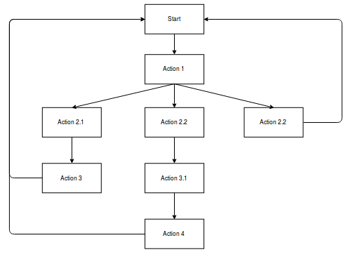
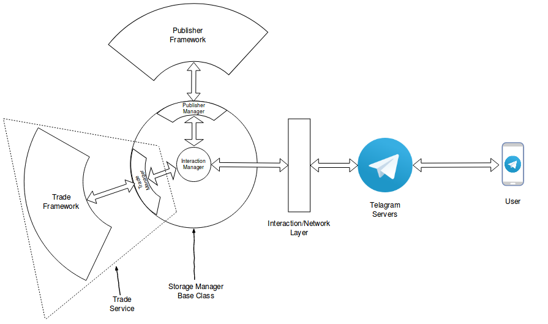

# Telegram Async Chatbot Framework

A simply-complex chatbot to cater many needs at one place. This simple
being can help you feed latest information out there on internet and can
act according to you will.

## Architecture

This app is divided in many very loosely coupled components. Some terms
related to this are:

- **Interaction/Network Layer**: Layer that can exchange the data/messages
with Telegram and thus user and then pass the received message to the
internal processing backend.

- **Interaction Manager**: Receives messages from `interaction layer` and
determines which `service` does this message belong.

- **Services**: Top level functionality provided by bot are called
Services. These consists of modules that are no where related to each other.

    Every Service consists of two components:
    - **Manager**: Registers the services with the `Interaction Manager`
    and exchanges the messages sent by it and passes them to the backend
    framework. All the managers are inherited from `base_service_manager`

    - **Backend Framework**: Final end point of messages. It is processed
    here and then the relevant response is sent back to te user.

    Some predefined services include
    - **Publisher service**: This part
    of bot works as the PUB-SUB system where all the publishers are the,
    well, Publishers and all the users are Subscribers. Publishers publish
    data on the channels and all the receivers receive that data.

        New sources for publishing can be easily defined by defining a class
        inheriting the `BasePublisher`.

- **Actions**: There are the basic unit User-Bot interaction. The bot will
issue the actions will result in some output and actions following it.

    Actions can be considered as a dynamic directed cyclic graph.

made using [draw.io](draw.io)

#### Tech Stack:
The bot is designed to work asynchronously.

- The server is built upon `aiohttp`.
- Whenever a message is arrived, new job is scheduled in an `aiojobs` scheduler.
- Messages are sent to the user in an `aiohttp` ClientSession.

To utilize the benefits of asynchronous architecture, make sure you write you
code using that framework only.

The complete architecture can be represented as:

made using [draw.io](draw.io)

**Storage Manager Base Class** shown in the diagram is the class that will
manage the database interaction. It will provide methods for storing and
retrieving data from database.

### TODO

- Add database methods for Async database interaction
- Add Sub-modules in Interaction layer for reusing the architecture
for multiple messenger services
